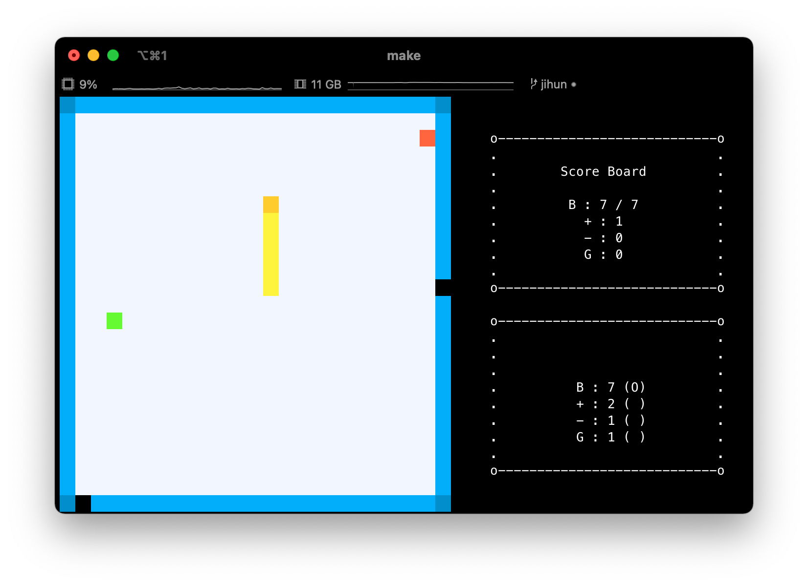

# SnakeGame
2022 C++ SnakeGame
- 20191683 최지훈
- 20191557 김민제

# 실행하기
1. 파일 다운로드
2. ```ncurses``` library 설치
- linux ```$ apt-get install libncurses5-dev libncursesw5-dev```
- mac os ```$ brew install ncurses```
3. ```$ make```

# 실행 화면

